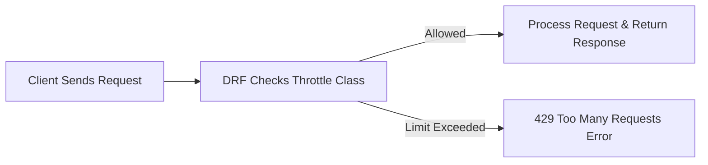

# ⚡ Throttling in Django REST Framework
## 🔹 Definition
**Throttling** in Django REST Framework (DRF) is a way to **control the rate of requests** that a client can make to the API.
It helps prevent **abuse, overuse, or DDoS attacks** by limiting requests based on time.

---

## 🔹 Why We Use It?

- Protect API from **too many requests** by a single user.
- Ensure **fair usage** across multiple clients.
- Reduce **server load** and avoid crashes.
- Improve **security** by blocking spammers and bots.

---

## 🔹 Throttling Flow (Diagram)



---

## 🔹 Types of Throttling in DRF

1. **AnonRateThrottle** → Limits requests from **unauthenticated (anonymous)** users.
2. **UserRateThrottle** → Limits requests from **authenticated** users.
3. **ScopedRateThrottle** → Apply different limits for different parts of the API.

---

## 🔹 Setup Throttling in `settings.py`

```python
REST_FRAMEWORK = {
    'DEFAULT_THROTTLE_CLASSES': [
        'rest_framework.throttling.AnonRateThrottle',
        'rest_framework.throttling.UserRateThrottle',
    ],
    'DEFAULT_THROTTLE_RATES': {
        'anon': '5/minute',     # 5 requests per minute for anonymous users
        'user': '10/minute',    # 10 requests per minute for authenticated users
    }
}
```

---

## 🔹 Example API View

```python
from rest_framework.views import APIView
from rest_framework.response import Response
from rest_framework.throttling import UserRateThrottle

class StudentAPI(APIView):
    throttle_classes = [UserRateThrottle]  # Apply throttling here

    def get(self, request):
        return Response({"message": "Welcome! You are allowed"})
```

---

## 🔹 API Response

✅ Within limit:

```json
{
  "message": "Welcome! You are allowed"
}
```

❌ If limit exceeded:

```json
{
  "detail": "Request was throttled. Expected available in 60 seconds."
}
```

---

## 🔹 Scoped Throttling Example

```python
# settings.py
REST_FRAMEWORK = {
    'DEFAULT_THROTTLE_CLASSES': [
        'rest_framework.throttling.ScopedRateThrottle',
    ],
    'DEFAULT_THROTTLE_RATES': {
        'student_api': '5/minute',
        'teacher_api': '20/minute',
    }
}
```

```python
# views.py
class StudentAPI(APIView):
    throttle_scope = 'student_api'  # Use this scope
    def get(self, request):
        return Response({"msg": "Student API Response"})

class TeacherAPI(APIView):
    throttle_scope = 'teacher_api'
    def get(self, request):
        return Response({"msg": "Teacher API Response"})
```

---

## 🔹 Key Points

- Throttling = **rate-limiting requests**.
- Types:

  - `AnonRateThrottle` → Anonymous users
  - `UserRateThrottle` → Logged-in users
  - `ScopedRateThrottle` → Custom per-API limits

- Returns **HTTP 429 Too Many Requests** when limit is exceeded.
- Configure in `settings.py` → `DEFAULT_THROTTLE_CLASSES` & `DEFAULT_THROTTLE_RATES`.
---
👉 Now you can paste this directly into your **GitHub README.md** for the **Throttling**